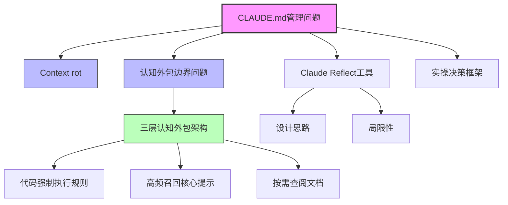

请帮我总结这个视频https://www.bilibili.com/video/BV1K7rSBJEPb?t=1.7
# B站视频内容总结

## 📹 视频信息
- **标题**：为什么你的CLAUDE.md越写越烂？90%的人搞错了边界
- **时长**：6:01
- **视频ID**：BV1K7rSBJEPb

## 📝 内容概览
本视频深入探讨了开发者社区中关于CLAUDE.md的争议，分析了CLAUDE.md越长是否会导致Claude表现变差的问题。视频从技术问题"Context rot"（上下文膨胀）切入，揭示其本质是"认知外包的边界问题"，提出了三层认知外包架构，并分析了Claude Reflect等工具的设计思路与局限，最终给出了管理AI协作认知边界的实操决策框架。

## ⏱️ 关键时间节点
| 时间 | 内容 |
|------|------|
| 0:00 | 视频开场，引出CLAUDE.md越长是否会导致Claude表现变差的问题 |
| 0:30 | 介绍开发者社区中关于CLAUDE.md的激烈争论：有人写500行，有人一行不写 |
| 1:15 | 从技术问题"Context rot"（上下文膨胀）切入，解释其本质 |
| 2:00 | 揭示问题本质是"认知外包的边界问题" |
| 2:45 | 提出三层认知外包架构：代码强制执行规则、高频召回核心提示、按需查阅文档 |
| 3:30 | 详细解释三层架构的具体内容和应用场景 |
| 4:15 | 分析Claude Reflect等工具的设计思路与局限 |
| 5:00 | 给出管理AI协作认知边界的实操决策框架 |
| 5:30 | 总结视频内容，强调明确认知边界的重要性 |

## 💡 核心知识点
1. **Context rot（上下文膨胀）**：指随着CLAUDE.md内容增多，Claude处理上下文的效率和准确性下降的现象
2. **认知外包边界问题**：CLAUDE.md越长表现越差的本质原因，即过度依赖AI处理本应由人类或其他工具处理的任务
3. **三层认知外包架构**：
   - 第一层：能用代码强制执行的规则（如Linting）
   - 第二层：高频召回的核心提示（CLAUDE.md精简版）
   - 第三层：按需查阅的文档（外部链接）
4. **Claude Reflect工具**：分析其设计思路与局限性，帮助理解AI协作工具的适用场景
5. **AI协作认知边界管理**：明确什么该放、什么不该放CLAUDE.md的决策框架

## 🕸️ 知识图谱

